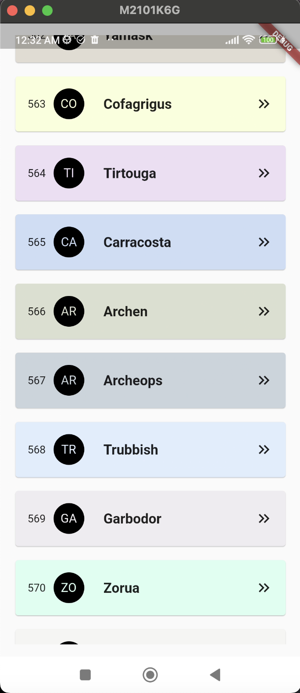
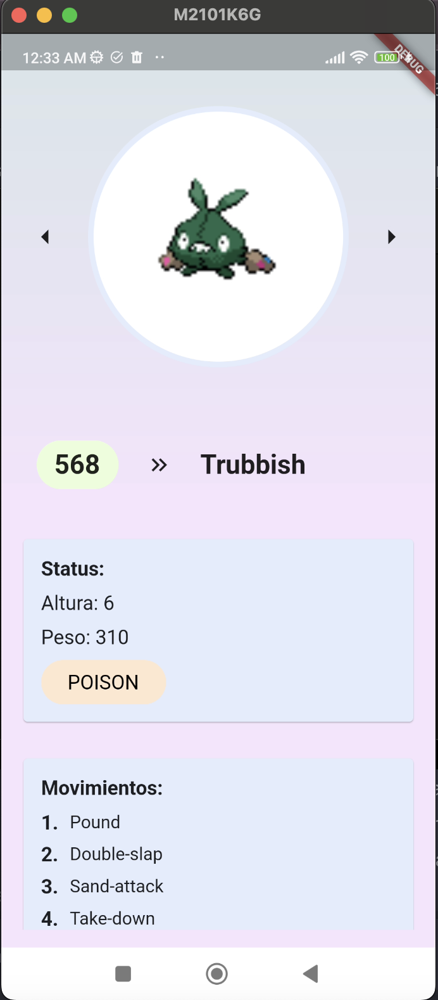

# PokeApp

PokeApp es una aplicación móvil desarrollada en Flutter que te permite explorar la emocionante lista de Pokémon. La aplicación se conecta a la API de Pokémon en [pokeapi.co](https://pokeapi.co/) para proporcionar información detallada sobre estos adorables monstruos de bolsillo.

## Características

- **Listado Infinito**: La aplicación te permite explorar la lista de Pokémon a través de un scroll infinito con paginación de 30 elementos por llamada, lo que significa que siempre tendrás más Pokémon para descubrir.

- **Detalles de Pokémon**: Al tocar un Pokémon en la lista, puedes acceder a su página de detalles, donde encontrarás información detallada, como peso, altura, movimientos y tipo.

- **Imágenes Variadas**: En la página de detalles, podrás ver imágenes de diferentes formas de Pokémon, incluyendo femenino, shinny y más.

- **Animación Divertida**: Disfruta de una animación que hace que la imagen del Pokémon flote indefinidamente en la pantalla.

- **Tipos Múltiples**: Los Pokémon pueden tener múltiples tipos, y la aplicación te permite explorarlos de manera conveniente con un scroll horizontal.

## Arquitectura y State Management

PokeApp está construida siguiendo la arquitectura Model-View-ViewModel (MVVM) para una estructura de código clara y mantenible. El state management se logra con [Stacked](https://pub.dev/packages/stacked), una biblioteca que facilita la gestión del estado en Flutter.

## Contacto

¡Si deseas comunicarte con Juan David Cano o conocer más acerca de él, puedes hacerlo a través de estos medios:

- **WhatsApp**: [+573002136150](tel:+573002136150)
- **LinkedIn**: [Perfil de LinkedIn](https://www.linkedin.com/in/juancano5304/)

## Prueba Técnica para Binaps

Esta aplicación fue creada como parte de una prueba técnica para la empresa Binaps. Representa un ejemplo de las habilidades y capacidades de Juan David Cano en el desarrollo de aplicaciones móviles con Flutter.

## Capturas de Pantalla

## Instalación

Puedes usar tu dispositivo iOs, Android o incluso usar tu navegador web para correr esta aplicación

¡Disfruta explorando el mundo de los Pokémon con PokeApp!
